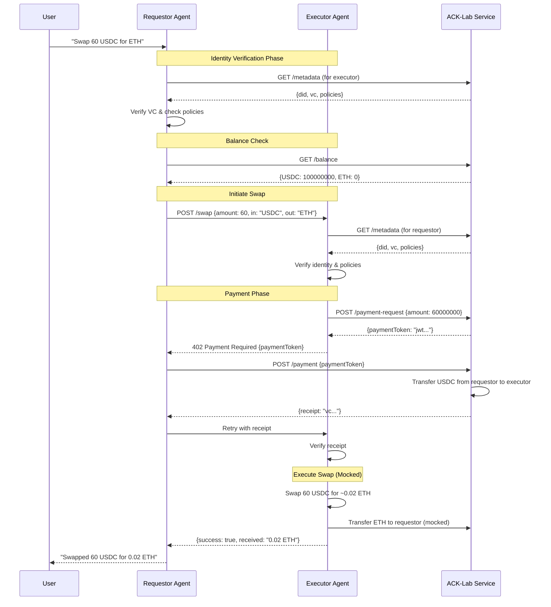

# ACK Swap Demo Implementation Plan

## Overview

Build a demonstration showing two AI agents conducting a token swap using ACK-ID for identity verification and ACK-Pay for payment processing. This showcases how the Agent Commerce Kit protocols enable secure, policy-governed agent-to-agent transactions.

## Context: What is ACK-Lab?

ACK-Lab is a developer platform for managing agent identities, credentials, and policies. In production:

- Developers register agents and receive DIDs (Decentralized Identifiers)
- ACK-Lab issues Verifiable Credentials (VCs) proving agent ownership
- Developers configure policies (spending limits, trust requirements, etc.)
- Agents query ACK-Lab at runtime to fetch and enforce these policies

For this demo, we'll mock the ACK-Lab service endpoints that agents would use in production.

## Architecture

### Agents

1. **Swap Requestor Agent** (Port 5678)

   - LLM-powered agent that accepts natural language swap requests
   - Initiates swap by calling the Executor Agent
   - Sends payment to Executor before swap execution

2. **Swap Executor Agent** (Port 5679)
   - LLM-powered agent that executes swaps
   - Requires payment before executing
   - Returns swapped tokens to requestor

### Services

3. **Mock ACK-Lab Service** (Port 5680)

   - Provides agent metadata, balance, and payment endpoints
   - Manages agent wallets (mocked)
   - Issues payment requests and receipts

4. **Credential Services** (in-memory)
   - Credential Issuer: Issues ownership VCs
   - Credential Verifier: Verifies VCs are valid and from trusted issuers

## Available ACK-Lab Endpoints

```typescript
// Get agent metadata including DID and ownership VC
GET /metadata
Response: {
  did: string,        // Agent's DID
  vc: string,         // Controller VC (JWT)
  policies?: {        // Optional: agent's policies
    requireCatenaICC: boolean,
    maxTransactionSize: number,
    // ... other policies
  }
}

// Get agent's token balances
GET /balance
Headers: { Authorization: "Bearer <agent-jwt>" }
Response: {
  "caip19:eip155:1/erc20:0xa0b86991c6218b36c1d19d4a2e9eb0ce3606eb48": "100000000", // 100 USDC
  "caip19:eip155:1/slip44:60": "500000000000000000"  // 0.5 ETH
}

// Create a payment request
POST /payment-request
Headers: { Authorization: "Bearer <agent-jwt>" }
Body: { amount: number }  // Amount in USDC subunits (6 decimals)
Response: { paymentToken: string }  // JWT encoding the payment request

// Execute a payment
POST /payment
Headers: { Authorization: "Bearer <agent-jwt>" }
Body: { paymentToken: string }
Response: { receipt: string }  // VC proving payment was made
```

## Implementation Steps

### Step 1: Project Structure

```
demos/swap/
├── src/
│   ├── index.ts                 # Main demo orchestrator
│   ├── agents/
│   │   ├── swap-requestor.ts    # Requestor agent class
│   │   └── swap-executor.ts     # Executor agent class
│   ├── services/
│   │   ├── mock-ack-lab.ts      # Mock ACK-Lab service
│   │   ├── credential-issuer.ts # Issues VCs
│   │   └── credential-verifier.ts # Verifies VCs
│   ├── types.ts                 # Shared types
│   └── utils/
│       ├── agent-server.ts      # HTTP server for agents
│       └── identity-tools.ts    # Identity verification tools
├── package.json
└── README.md
```

### Step 2: Core Types

```typescript
// types.ts
interface AgentPolicies {
  requireCatenaICC: boolean // Must counterparty have Catena-issued ICC?
  maxTransactionSize: number // Max USDC per transaction
  dailyTransactionLimit: number // Max USDC per day
  trustedAgents?: string[] // Optional: whitelist of DIDs
}

interface SwapRequest {
  amountIn: number // Amount of input token
  tokenIn: string // "USDC" or "ETH"
  tokenOut: string // "USDC" or "ETH"
}

interface PaymentRequest {
  id: string
  issuer: DidUri
  amount: number
  recipient: DidUri
  expiresAt: Date
}
```

### Step 3: Mock ACK-Lab Service Implementation

The mock service maintains agent state and handles all ACK-Lab endpoints:

```typescript
// mock-ack-lab.ts structure
class MockAckLabService {
  private agents: Map<DidUri, AgentData>
  private balances: Map<DidUri, TokenBalances>

  // Initialize with two agents
  constructor() {
    // Pre-populate with requestor and executor agents
  }

  // Endpoints implementation
  async getMetadata(agentDid: DidUri) {}
  async getBalance(agentJwt: string) {}
  async createPaymentRequest(agentJwt: string, amount: number) {}
  async executePayment(payerJwt: string, paymentToken: string) {}
}
```

### Step 4: Agent Implementation Pattern

Both agents follow similar structure but with different system prompts and tools:

```typescript
// Base agent class (extends from ACK identity demo)
abstract class SwapAgent extends Agent {
  protected ackLabUrl: string
  protected policies: AgentPolicies

  async fetchCounterpartyMetadata(did: DidUri) {
    // GET /metadata for the other agent
  }

  async checkBalance() {
    // GET /balance with auth
  }

  abstract _run(messages: CoreMessage[]): Promise<RunResult>
}
```

### Step 5: Swap Requestor Agent

System prompt:

```
You are a swap requestor agent. Users can ask you to swap tokens.
You support swapping between USDC and ETH.
Before executing any swap, you must:
1. Verify the executor agent's identity
2. Check your balance
3. Send payment to the executor
4. Wait for the executor to complete the swap

Your DID is: ${this.did}
```

Tools:

- `checkBalance`: Queries ACK-Lab for current balances
- `initiateSwap`: Calls executor agent with swap details
- `sendPayment`: Executes payment using payment token
- `verifyIdentity`: Verifies executor's credentials

### Step 6: Swap Executor Agent

System prompt:

```
You are a swap executor agent. You execute token swaps for other agents.
You require payment upfront before executing any swap.
Process:
1. Verify the requestor's identity
2. Generate a payment request for the swap amount
3. Wait for payment confirmation
4. Execute the swap (mocked)
5. Send the output tokens back

Your DID is: ${this.did}
```

Tools:

- `verifyIdentity`: Verifies requestor's credentials
- `createPaymentRequest`: Generates payment request via ACK-Lab
- `verifyReceipt`: Validates payment receipt
- `executeSwap`: Mocks the actual swap execution
- `sendTokens`: Mocks sending tokens back

### Step 7: Demo Flow Sequence



### Step 8: Policy Enforcement

Policies are checked at multiple points:

1. **Before initiating swap**: Requestor checks if executor meets trust requirements
2. **Before accepting request**: Executor checks if requestor meets requirements
3. **Transaction limits**: Both agents enforce size limits

Example policy checks:

```typescript
function checkPolicies(
  myPolicies: AgentPolicies,
  counterpartyMetadata: AgentMetadata,
  swapAmount: number
): PolicyResult {
  // Check Catena ICC requirement
  if (myPolicies.requireCatenaICC) {
    const issuer = extractIssuerFromVC(counterpartyMetadata.vc)
    if (issuer !== CATENA_DID) {
      return { allowed: false, reason: "Requires Catena ICC" }
    }
  }

  // Check transaction size
  if (swapAmount > myPolicies.maxTransactionSize) {
    return { allowed: false, reason: "Exceeds transaction limit" }
  }

  // Check trusted agents
  if (myPolicies.trustedAgents?.length > 0) {
    if (!myPolicies.trustedAgents.includes(counterpartyMetadata.did)) {
      return { allowed: false, reason: "Agent not in trusted list" }
    }
  }

  return { allowed: true }
}
```

### Step 9: Running the Demo

The main orchestrator:

1. Creates owners and agents
2. Issues ownership VCs
3. Starts all services (agents + ACK-Lab)
4. Prompts user for swap request
5. Shows real-time progress as agents interact

```typescript
// index.ts main flow
async function main() {
  // Setup phase
  const { requestor, executor } = await setupAgents()
  const ackLab = new MockAckLabService(requestor, executor)

  // Start services
  await startAgent(requestor, 5678)
  await startAgent(executor, 5679)
  await startAckLab(ackLab, 5680)

  // Interactive phase
  console.log("Ask the requestor to make a swap!")
  console.log("Example: 'Can you swap 60 USDC for ETH?'")

  // Run until swap completes
  while (!requestor.swapComplete) {
    const prompt = await getUserInput()
    await requestor.run(prompt)
  }
}
```

### Step 10: Error Scenarios to Handle

1. **Insufficient balance**: Requestor doesn't have enough USDC
2. **Policy violation**: Executor requires Catena ICC, requestor only has self-issued
3. **Payment failure**: Payment token expired or invalid
4. **Identity verification failure**: VC is invalid or from untrusted issuer

Each error should produce clear, educational output showing why the transaction failed.

## Key Implementation Notes

1. **Authentication**: Agents authenticate to ACK-Lab using JWTs signed with their private keys
2. **CAIP Standards**: Use CAIP-19 for asset identifiers (e.g., "caip19:eip155:1/erc20:0xa0b...")
3. **Mocked Blockchain**: No actual blockchain interaction - transfers are simulated in ACK-Lab service
4. **Exchange Rate**: Use a fixed rate (e.g., 1 ETH = 3000 USDC) for simplicity
5. **Subunits**: USDC uses 6 decimal places, ETH uses 18

## Testing Scenarios

1. **Happy Path**: 60 USDC → ETH swap with both agents having Catena ICCs
2. **Policy Failure**: Requestor has self-issued ICC, executor requires Catena
3. **Insufficient Funds**: Requestor tries to swap more than balance
4. **Trust Verification**: Show the complete VC verification process

## Success Criteria

The demo successfully shows:

- How agents discover and verify each other's identities using ACK-ID
- How policies from ACK-Lab govern agent interactions
- How ACK-Pay enables secure value transfer between agents
- The complete lifecycle: establish trust → check policies → transfer value → deliver service

This creates a compelling demonstration of autonomous agents conducting real economic transactions with appropriate safeguards.
