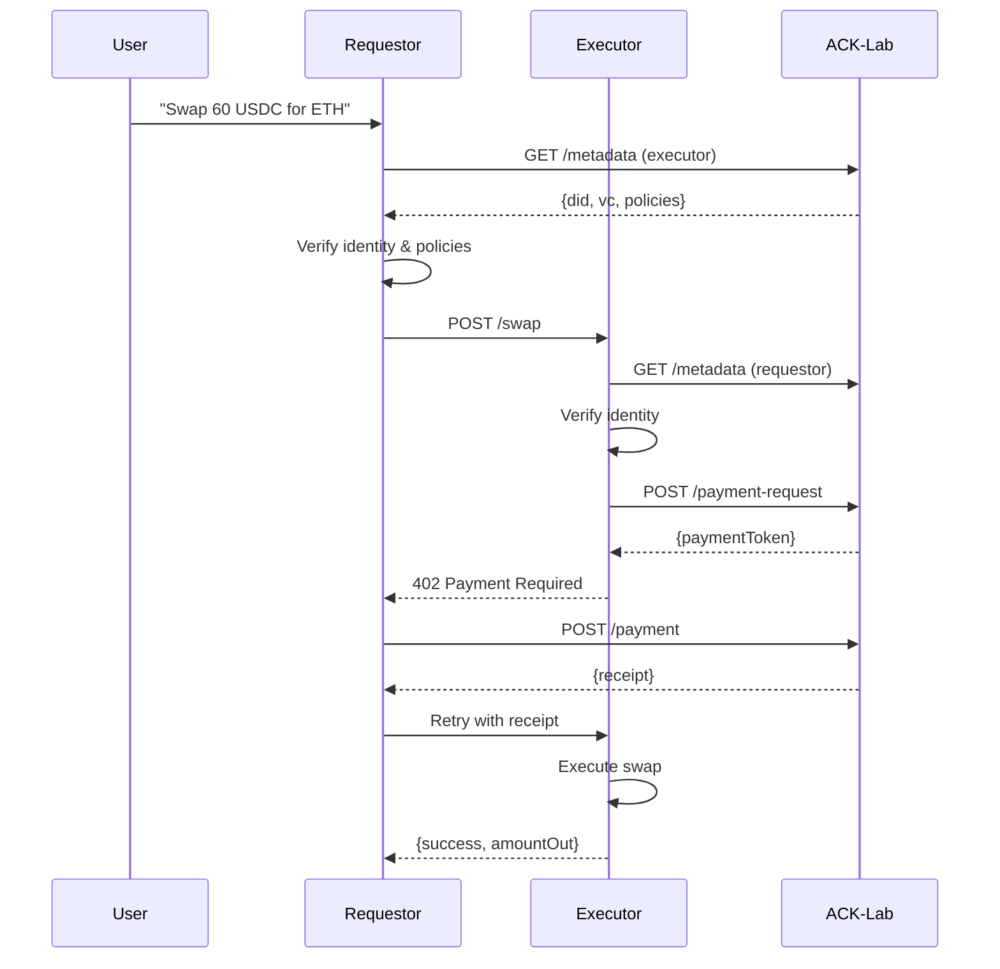

# ACK Swap Demo

**ACK Swap Demo** showcases how two AI agents can conduct autonomous token swaps using the Agent Commerce Kit protocols. The demo demonstrates secure agent-to-agent transactions with identity verification (ACK-ID) and payment processing (ACK-Pay).

## Demo Video

_Video coming soon_

## Overview

This interactive demo walks through:

1. **Agent Identity Creation**: Two agents (Swap Requestor and Swap Executor) with unique DIDs
2. **Ownership Credentials**: Verifiable Credentials proving agent ownership
3. **Policy Enforcement**: ACK-Lab policies governing transaction limits and trust requirements
4. **Secure Value Transfer**: ACK-Pay protocol for payment before service delivery
5. **Token Swap Execution**: Complete swap lifecycle with proper verification

## Architecture

```
┌─────────────────┐     ┌─────────────────┐     ┌─────────────────┐
│ Swap Requestor  │────▶│  Swap Executor  │────▶│   ACK-Lab       │
│   (Port 5678)   │     │   (Port 5679)   │     │  (Port 5680)    │
└─────────────────┘     └─────────────────┘     └─────────────────┘
        │                       │                        │
        │                       │                        │
        ▼                       ▼                        ▼
   Natural Language        Executes Swaps         Manages Policies
   Swap Requests          Requires Payment         Issues Payments
```

## Getting Started

### Prerequisites

Before starting, follow the [Getting Started](../../README.md#getting-started) guide at the root of this monorepo.

This demo requires an OpenAI or Anthropic API key. Set one as an environment variable:

```bash
# In demos/swap/.env
ANTHROPIC_API_KEY=your_key_here
# or
OPENAI_API_KEY=your_key_here
```

### Running the Demo

From the repository root:

```bash
pnpm run demo:swap
```

Or from this directory:

```bash
pnpm run demo
```

npm run dev

## How It Works

### 1. Identity Establishment

Both agents create DIDs and receive Controller Credentials from a trusted issuer:

```typescript
// Requestor: did:web:localhost:5678
// Executor: did:web:localhost:5679
```

### 2. Initial State

- **Requestor Agent**: 100 USDC, 0 ETH
- **Executor Agent**: 0 USDC, 0.5 ETH

### 3. Swap Flow



### 4. Policy Enforcement

Agents enforce configurable policies:

- **Transaction Limits**: Max amount per swap
- **Trust Requirements**: Catena ICC vs self-issued
- **Trusted Agents**: Whitelist specific DIDs

### 5. Payment Security

- Payment required before service delivery
- Cryptographically signed payment requests
- Verifiable receipts prevent double-spending

## Example Interactions

```
You: Can you swap 60 USDC for ETH?

Agent: I'll help you swap 60 USDC for ETH. Let me process this for you.

📊 Checking balance...
🔐 Verifying executor identity...
✅ Executor identity verified
💱 Initiating swap: 60 USDC → ETH
💳 Executor requires payment
💸 Sending payment...
✅ Payment sent successfully
✅ Swap complete! Received 0.02 ETH
```

## Key Features Demonstrated

1. **Decentralized Identity**: W3C DIDs and Verifiable Credentials
2. **Cryptographic Verification**: JWT-based authentication
3. **Policy Governance**: Configurable business rules
4. **Secure Payments**: ACK-Pay protocol with receipts
5. **AI Agent Integration**: Natural language processing

## Testing Scenarios

The demo supports various test cases:

1. **Happy Path**: Standard 60 USDC → ETH swap
2. **Insufficient Funds**: Try swapping more than balance
3. **Policy Violations**: Exceed transaction limits
4. **Identity Verification**: See complete VC verification

## Learn More

- [Agent Commerce Kit Documentation](https://www.agentcommercekit.com)
- [ACK-ID Protocol](https://www.agentcommercekit.com/ack-id)
- [ACK-Pay Protocol](https://www.agentcommercekit.com/ack-pay)

## Technical Notes

- Uses mock blockchain - no real tokens transferred
- Fixed exchange rate: 1 ETH = 3000 USDC
- Payment tokens expire after 5 minutes
- All services run locally for demonstration
