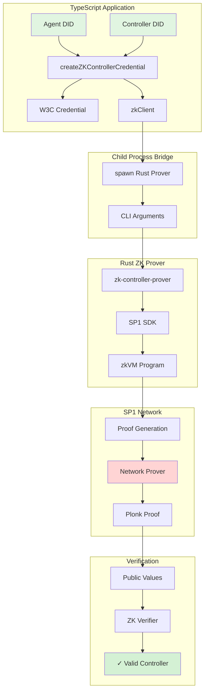

# ACK-ZK: Zero-Knowledge Controller Credentials

ACK-ZK enables privacy-preserving verification of controller relationships in the Agent Commerce Kit ecosystem. It allows agents to prove they have a valid controller without revealing the controller's identity.

## 🏗️ Architecture Overview



## 🔐 Protocol Flow

1. **Credential Creation**: A controller issues a credential to an agent
2. **ZK Proof Request**: Agent requests a ZK proof of the controller relationship
3. **Child Process Execution**: TypeScript spawns Rust prover as child process
4. **zkVM Execution**: SP1 zkVM runs the controller claim program
5. **Network Proof**: SP1 network generates a cryptographic proof
6. **Verification**: Anyone can verify the proof without learning the controller's identity

## 📁 File Structure & Responsibilities

### TypeScript Files (packages/ack-zk/src/)

#### `zk-controller-credential.ts`
- Creates W3C controller credentials
- Integrates with ZK proof generation
- Spawns Rust prover when `generateZKProof: true`

#### `zk-controller-verifier.ts`
- Implements ZK-enhanced claim verifier
- Verifies proofs without revealing controller identity
- Falls back to standard verification when no ZK proof

#### `zk-client.ts`
- SP1 ZK Client implementation
- Manages child process spawning
- Handles communication with Rust prover
- Parses proof results from JSON

#### `utils.ts`
- Utility functions (SHA-256 hashing)

### Rust Files (rust-zk-service/)

#### `script/src/bin/zk-controller-prover.rs`
- CLI tool for proof generation
- Interfaces with SP1 SDK
- Handles network/local proving
- Outputs JSON results for TypeScript

#### `program/src/main.rs`
- zkVM program (runs inside SP1)
- Validates controller relationships
- Commits public values
- Core ZK logic

### Test Files

#### `zk-controller-credential.test.ts`
- Tests credential creation with/without ZK proofs
- Verifies child process integration

#### `zk-controller-verifier.test.ts`
- Tests ZK proof verification
- Tests invalid proof rejection

## 🚀 Running Tests

### Prerequisites

1. **Build the Rust prover:**
```bash
cd rust-zk-service
cargo build --release --bin zk-controller-prover
```

2. **Install TypeScript dependencies:**
```bash
cd packages/ack-zk
pnpm install
```

### Test Execution

#### Quick Testing (Mock Prover)
```bash
# Fast, no real proofs generated
SP1_PROVER=mock pnpm test
```

#### Network Testing (Real Proofs)
```bash
# Uses SP1 network, takes 2-5 minutes per proof
SP1_PROVER=network \
NETWORK_PRIVATE_KEY=0x9c9f28688fcdf245fb977bc9571b2e1040d9a35778842b606318c6706f4a8c8d \
NETWORK_RPC_URL=https://rpc.production.succinct.xyz \
pnpm test
```

#### Watch Mode
```bash
# For development
SP1_PROVER=mock pnpm test:watch
```

## 🌐 SP1 Network Integration

The SP1 network provides decentralized proof generation:

1. **Proof Request**: The prover sends the zkVM execution trace to the network
2. **Distributed Proving**: Network nodes collaborate to generate the proof
3. **Proof Delivery**: Completed proof is returned to the client
4. **On-chain Verification**: Proofs can be verified on any EVM chain

### Network Configuration

- **RPC URL**: `https://rpc.production.succinct.xyz`
- **Proof Systems**: Plonk (fast), Groth16 (compact)
- **Timeout**: 14400 seconds (4 hours)
- **Cost**: Network fees apply for proof generation

## 🔍 Example Output

```
🧪 Test: Creating credential with ZK proof (spawning Rust prover)
[SP1] === ACK Controller Claim Prover ===
[SP1] Agent DID: did:key:z6MkhVTX9BF3NGYX6cc7jWpbNnR7jMWmTTzMWcmGNaATJEk2
[SP1] Controller DID: [HIDDEN]
[SP1] Using SP1 Prover Network (SP1_PROVER=network)
[SP1] === Generating Proof ===
[SP1] Proof System Selected: Plonk
[SP1] Created request 0x5d4c75ea... in transaction 0x49740038...
[SP1] Proof request assigned, proving...
[SP1] Proof verified successfully!
✅ ZK Proof generated successfully!
   Agent DID Hash: 59ca5f167fc6cc6e...
   Controller Commitment: 8551f404ecfe6403...
```

## 🛡️ Security Properties

- **Privacy**: Controller DIDs are never revealed
- **Verifiability**: Anyone can verify the proof
- **Non-forgeability**: Proofs cannot be faked without the private inputs
- **Expiration**: Credentials expire after 90 days

## 🔧 Development Tips

1. Use `SP1_PROVER=mock` for fast iteration
2. Set `NODE_ENV=test` to see child process output
3. Check `/tmp/proof_*.json` for debugging proof generation
4. Network proofs cost money - use mock for development